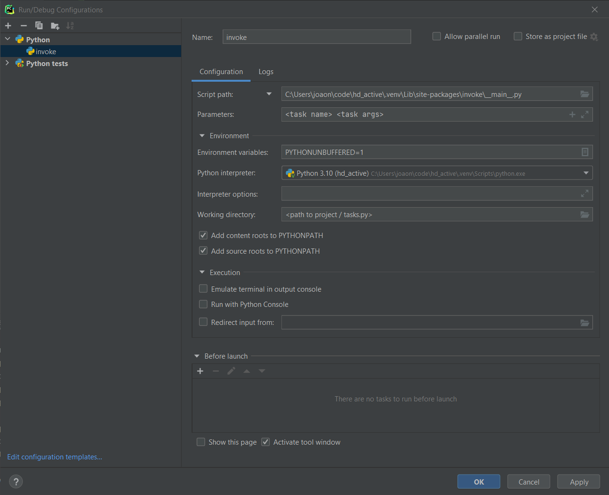

# Development

To get started with development of this project:

1. Clone
   Virtual environment recommended, but optional.  
   Developed with Python 3.7, but should be straightforward to upgrade to newer versions.
2. `pip install -U -r requirements-dev.txt`
3. `pre-commit install`

## UI
This project uses [Qt 6](https://www.qt.io) for its UI components.

`Qt Designer` is used to create the UI, which outputs a `.ui` file (XML content that describes the
UI). This file is then transformed into a `.py` file.

All the required tools are available by installing `pyside6`:

* `Qt Designer`: `pyside6-designer`
* `.ui > .py` Converter: `pyside6-uic`
  At the project root (use full paths if relative doesn't work):
  ```
  pyside6-uic assets/ui/settings.ui -o hd_active/ui/forms/ui_settings_dialog.py
  ```

!!! Note

    Qt is not necessarily required, something like Tkinter could have been used (more open and
    included in Python), and the latest version of Qt (6) isn't necessary, something more
    established like Qt 5 could have been used, but I wanted to dip my toes into the Qt world and
    figured using the latest version would give me more lasting knowledge.

## Test
[pytest](https://pytest.org) is used for testing and main features used are fixtures, parameters
and markers. When working on test cases, make sure you're familiar with how these work.

### Markers
Markers are used to distinguish tests with `pytest.mark.<marker_name>`.

List of markers used, defined in `pyproject.toml`

| Marker | Description                                       |
|:-------|:--------------------------------------------------|
| `windows` | Test case valid on Windows operating system only. |

## Development tasks
This project uses **pyinvoke** ([main page](https://www.pyinvoke.org/) | [docs](https://docs.pyinvoke.org/en/stable/) |
[GitHub](https://github.com/pyinvoke/invoke)) to facilitate executing miscellaneous tasks that help
with development.

### Using invoke
After the installing the dev requirements (which include `invoke`), try the commands below.

List all available tasks:
```
inv --list
```

Tasks are grouped (those that have a `.`). To see all the _lint_ tasks:
```
inv --list lint
```

Help with a certain task:
```
inv --help pip.package
```

Use `--dry` to see what the task does without executing it.

### Debugging tasks
To debug `tasks.py` (the file used by `invoke`), either add a `breakpoint()` statement or, if using
an IDE (in this example PyCharm), use the configuration below to allow setting breakpoints in the
code and debug `tasks.py` as any other Python file.



## Documentation
Install documentation requirements with:
```
pip install -r requirements-docs.txt
```

You can then edit the `.md` files under the `docs` directory and, if more need to be added, update
`mkdocs.yml`.

### View locally

* Web server (recommended)
  ```
  mkdocs serve
  ```
* Static files
  ```
  mkdocs build
  ```
  This generates a static website under `/site`, which is in `.gitignore`.

### Update in GitHub

Simply run the command below to push the documentation to GitHub pages.

```
mkdocs gh-deploy
```

More instructions [here](https://www.mkdocs.org/user-guide/deploying-your-docs/#github-pages).

The first time `gh-deploy` is used, authorization needs to be granted to publish to GitHub Pages.
A _GitHubCredentials_ widget appears and follow the prompts.

Documentation available here: [https://joaonc.github.io/hd_active](https://joaonc.github.io/hd_active)

When running this command, it's this website that needs to be updated (unless working in a forked
project). Until a process is established for other people to update this GitHub Page location,
please contact me and I'll push the documentation changes as needed.
